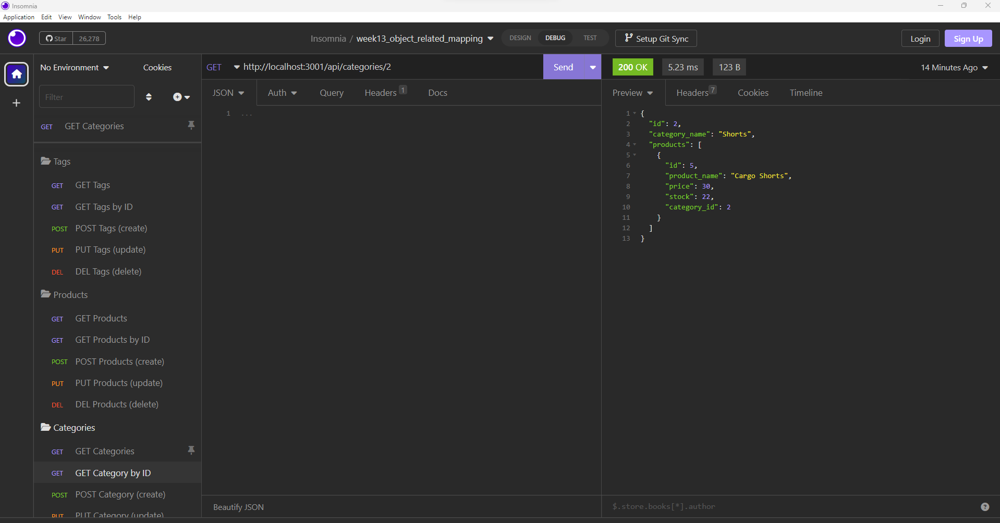

# README by Jungwoo Lee
  

## 1. Title: week13_E_Commerce_Back_End

## 2. Table of Contents:
This readme file includes the following contents:
+ [Description](#3-description)
+ [Installation](#4-installation)
+ [Usage](#5-usage)
+ [License](#6-license)
+ [Application results](#7-application-results)
+ [Questions](#8-questions)

## 3. Description: 
Internet retail, also known as **e-commerce**, is the largest sector of the electronics industry, generating an estimated $29 trillion in 2019. E-commerce platforms like Shopify and WooCommerce provide a suite of services to businesses of all sizes. Due to their prevalence, understanding the fundamental architecture of these platforms will benefit you as a full-stack web developer.

This application is the back end for an e-commerce, and this app utilizes the Express.js API to use Sequelize to interact with a MySQL database.

## 4. Installation:
Please make sure to have following programs installed on your computer to use this app:
+ VS Code
+ GitBash
+ Node.js
+ MySQL

To use this program, `git clone` the repo down to your local. Then, run `npm install` in order to install the `npm` package dependencies as specified in the `./package.json` - `Express.js`, `mysql2`, `sequelize`, and `dotenv` will be installed. Now, you are ready to go!

## 5. Usage:
To use this application, follow the instruction below: 
+ First, run `npm install` on your terminal, then it will install the required `npm` packages.
+ Second, let's create the database - `ecommerce_db`:
  + `mysql -u root -p`: login to `MySQL` then type the following commends:
  + `source ./db/schema.sql;`: this will create `ecommerce_db`
  + `show databases;`: Now, you will see `ecommerce_db` in the `Database` list
  + `use ecommerce_db;`: it is empty now.
  + `show tables`: there is no tables yet.
  + `exit`: exit the mysql terminal
+ Third, let's include tables in the database we just created, `ecommerce_db`:
  + `node ./seeds/index.js` or `npm run seed`: these will insert the following tables in the `ecommerce_db`:
    + `category`
    + `product`
    + `product_tag`
    + `tag`
  + After seeding, the `ecommerce_db` will have something like in `./ecommerce_db.txt` - this will give you the starting information when using this application.
+ Now, let's run the program:
  + Set an Environmental Variable in `./.env` file:
    + `touch .env`: this will create `./.env` file
    + Now, add the following three lines in `./.env`
      + DB_NAME="ecommerce_db"
      + DB_USER="root"
      + DB_PASSWORD="your_mysql_password"
  + Then, run the program with one of the following approaches:
    + `node server.js` or `npm run start`: these will start `node` program in normal way. 
    + `nodemon server.js` or `npm run watch`: these will start `node` program with `nodemon`, which monitors the project directory and automatically restarts your node application when it detects any changes.
  + Now, check the results with `Insomnia`, a collaborative open source API development platform - https://insomnia.rest/.
    + 

This project has the following directory structure:
+ ./assets
  + week13_E_Commerce_Back_End.png: this app screenshot
  + week13_E_Commerce_Back_End.avi: this app usage workthrough video
+ ./config
  + connection.js: this will allow you to connect to the `mysql` database
+ ./db
  + schema.sql: this will create a database, `ecommerce_db`, with empty tables.
+ ./models: these javascript files will create `Sequelize` models for each table in `ecommerce_db`
  + Category.js
  + index.js
  + Product.js
  + ProductTag.js
  + Tag.js  
+ ./routes: these javascript files will create (or define) each route's behavior 
  + api
    + category-routes.js
    + index.js
    + product-routes.js
    + tag-routes.js
  + index.js
+ ./seeds: these javascript files will create (seed) tables in `ecommerce_db`
  + category-seeds.js
  + index.js
  + product-seeds.js
  + product-tag-seeds.js
  + tag-seeds.js
+ ./.gitignore: specifies intentionally untracked files that Git should ginore
+ ./ecommerce_db.txt: it shows the initial information of the `ecommerce_db`
+ ./LICENSE: MIT License 
+ ./package.json: specifics of npm's package.json handling
+ ./server.js: main node.js program Javascript file
+ ./README.md: readme file

## 6. License:
### The MIT License
  

## 7. Application results:
[GitHub:] https://github.com/jungwoo33/week13_E_Commerce_Back_End 
View walk through video here - [Screencastify](https://drive.google.com/file/d/1-mvqSfRs2jo0t-FRDafCOskzDIuqzmvm/view) 
or the original video file is in `./assets/week13_E_Commerce_Back_End.avi` 

## 8. Questions?:
If you have any questions, feel free to contact me via information below: 
[GitHub:] https://github.com/jungwoo33 
[Email:] jungwoo33@gmail.com

- - -
© 2023 Jungwoo Lee. Confidential and Proprietary. All Rights Reserved.